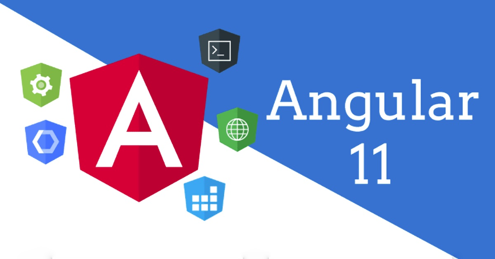
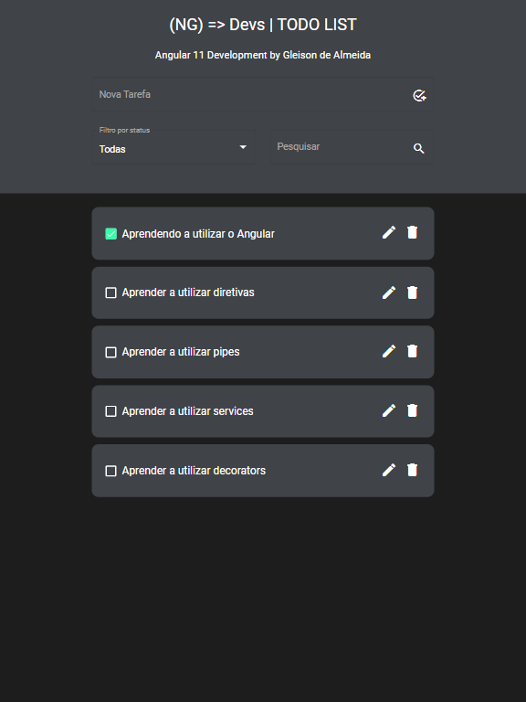
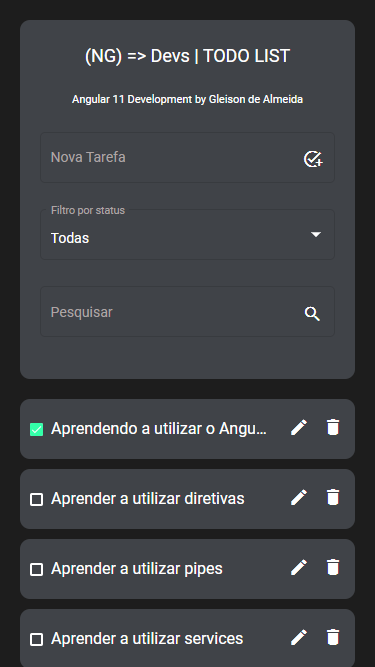

<div align="right">

[](README.md)
[](README-ENG.md)

</div>

<p align="center">
  
</p>

<p align="center">   
  
     
  <a href="https://github.com/gleisonkz">
    
  </a>  
  
       
</p>

<p align="center">
 <a href="#eye_speech_bubble-preview">Preview</a> •
 <a href="#information_source-about">About</a> •
 <a href="#arrow_forward-run">Run</a> •
 <a href="#hammer_and_wrench-technologies">Technologies</a> • 
 <a href="#brain-applied-concepts">Concepts</a> •
 <a href="#sparkles-features">Features</a> •
 <a href="#boy-author">Author</a> •
 <a href="#balance_scale-license">License</a>
</p>

---

## :eye_speech_bubble: **Preview**

<div align="center">

Front-end deployed at [Netlify](https://www.netlify.com/) to see: [Click Here](https://kz-angular-todo-list.netlify.app/)

|                             :computer:Desktop                             |                             :iphone: Mobile                              |
| :-----------------------------------------------------------------------: | :----------------------------------------------------------------------: |
| <kbd></kbd> | <kbd></kbd> |

</div>
  
---

## :information_source: About

<div align="center">

Application built to practice some concepts of my Angular Study's Group.

---

</div>

## :arrow_forward: **Run**

<div align="center">

To run this project you need to clone this repository, have the NOde Package Manager ([`NPM`](https://www.npmjs.com/get-npm)) or the YARN Package Manager ([`YARN`](https://yarnpkg.com/getting-started)) installed.

🌐 FrontEnd

Open the command prompt in the project directory at angular-todo-list/front-end, and execute the following commands:

<details>
  <summary><i>with <b>npm</b></i></summary>
  
  ```bash
  # Install dependencies
  $ npm install ou npm i

# Start development server

$ ng serve --open ou ng s -o

````

</details>

<details>
<summary><i>with <b>yarn</b></i></summary>

```bash
# Install dependencies
$ yarn install

# Start development server
$ ng serve --open ou ng s -o

````

</details>

> ⚠️ The development server will start on port: 4200 - Access <http://localhost:4200>

</div>

<div align="center">

---

🖥 BackEnd

Open the command prompt in the project directory at angular-todo-list/back-end, and execute the following commands:

<details>
<summary><i>with <b>npm</b></i></summary>

```bash
# Install dependencies
$ npm install ou npm i

# Start development server
$ npm run server

```

</details>

<details>
<summary><i>with <b>yarn</b></i></summary>

```bash
# Install dependencies
$ yarn install

# Start development server
$ yarn run server

```

</details>

> ⚠️ The development server will start on port: 3000 - <http://localhost:3000>

</div>

---

## :hammer_and_wrench: **Technologies**

<div align="center">

|             :globe_with_meridians: FrontEnd             |                        🖥 BackEnd                         |
| :-----------------------------------------------------: | :------------------------------------------------------: |
|            [Angular 11](https://angular.io/)            | [Json-Server](https://www.npmjs.com/package/json-server) |
|   [Angular Material 11](https://material.angular.io/)   |
|             [SASS](https://sass-lang.com/)              |
|   [TypeScript 4.0.2](https://www.typescriptlang.org/)   |
|      [Rxjs 6.6.0](https://rxjs.dev/guide/overview)      |
| [NgNeat Hot Toast](https://ngneat.github.io/hot-toast/) |

</div>

---

## :brain: **Applied Concepts**

<div align="center">

|                  :page_facing_up:                  |
| :------------------------------------------------: |
| Decorators @Output, @Input, @ViewChild and @Inject |
|            Directives *ngFor, *ngSwitch            |
|                 Template Variables                 |
|             Event and Property Binding             |
|                   Reactive Forms                   |
|                      Services                      |
|                  Injection Token                   |
|                Material Components                 |

</div>

---

## :sparkles: **Features**

<div align="center">

|                 :page_facing_up:                 |
| :----------------------------------------------: |
|                  Search by name                  |
|                 CRUD operations                  |
|                 Filter by status                 |
| Local Storage Service for production environment |
|                Responsive layout                 |
|            Custom Error State Matcher            |
|       Custom Directive for keyboard events       |

</div>

---

## :boy: **Author**

<div align="center">

<a href="https://github.com/gleisonkz">
 
 <br/>
 <sub><b>Gleison de Almeida</b></sub>
</a>

Developed with ❤️ by Gleison Almeida 👋🏽 Contact me!

[](https://www.linkedin.com/in/gleison-ribeiro-a65257119)
[](https://github.com/gleisonkz)
[](mailto:gleisonsubzerokz@gmail.com)

</div>

---

## :balance_scale: **License**

<div align="center">

Copyright © 2021 [Gleison Almeida](https://github.com/gleisonkz).<br />
This project is licensed by [MIT](./LICENSE).

</div>
